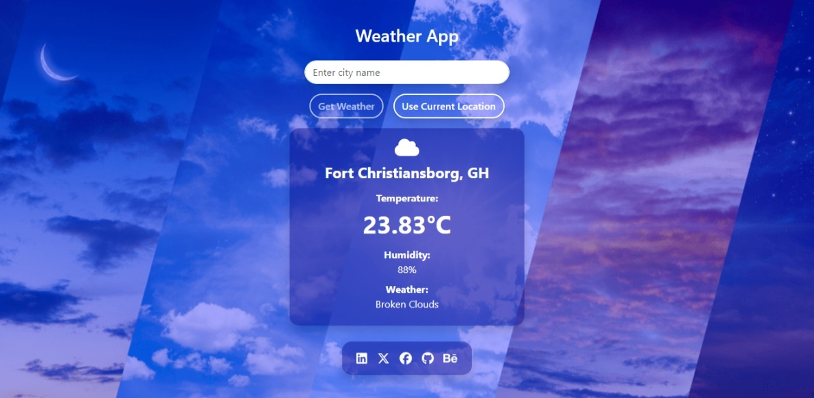
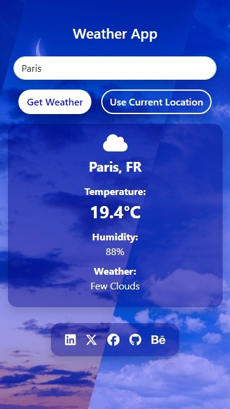

# Weather App in React JS

## Overview

This project is part of the Codevixens Frontend Development Challenge (Day 6). A simple weather app built using React. It demonstrates how to integrate with a weather API, manage state, and design a user-friendly interface.


## Features


- **API Integration**: Fetches weather data from the OpenWeatherMap API.
- **State Management**: Uses React's `useState` hook to manage the input city, fetched weather data, and error messages.
- **User Interface**: Provides an input field for city name, a button to fetch weather, and a display area for weather information.
- **Error Handling**: Handles invalid city names and API errors with appropriate feedback to the user.
- **Geolocation (In Progress)**: Allows users to fetch weather data based on their current location.
- **Weather Icons**: Displays relevant weather icons based on the weather description.
- **Bootstrap Styling**: Uses Bootstrap for a visually appealing and responsive UI.
- **Modal Alerts**: Displays alerts in a modal for user feedback.

## Installation

1. Clone the repository:

```bash
git clone https://github.com/gideonagyage/Weather-App.git
```

2. Navigate to the project directory:

```bash
cd Weather-App
```

3. Install dependencies:

```bash
npm install
```

## Usage

1. Start the development server:

```bash
npm start
```

2. Open your browser and navigate to

```bash
http://localhost:3000.
```

## How it Works

The `WeatherApp` component is the main component that handles the following:

1. **Input Handling**: Manages the user's input city name.
2. **API Calls**: Fetches weather data from the OpenWeatherMap API based on the input city or the user's location.
3. **State Updates**: Updates the state with fetched weather data, errors, and loading status.
4. **UI Rendering**: Renders the input field, button, weather information, and error messages.

## Screenshots

- Desktop Screenshot



- Mobile Screenshot



<br>

## Live Demo

Check out the live demo [here](https://weather-app-seven-murex-31.vercel.app/).

## Key Concepts

1. **API Integration**: Connecting your application to external services using APIs.
2. **State Management**: Managing the data and UI state of your React application.
3. **UI Design**: Creating a user-friendly and visually appealing interface.
4. **Error Handling**: Gracefully handling errors and providing appropriate feedback to the user.
5. **Geolocation**: Using the browser's geolocation API to access the user's location.

## Contributing

Feel free to fork this repository and submit pull requests. Any contributions are welcome!

## License

This project is licensed under the MIT License.

## Acknowledgements

- Codevixens for organizing the challenge.
- Chinaza Igboanugo, Lois Bassey, and Oyinkansola Shoroye for their contributions and guidance.

Feel free to customize it further to fit your needs! If you have any specific details you'd like to add or change, let me know.
